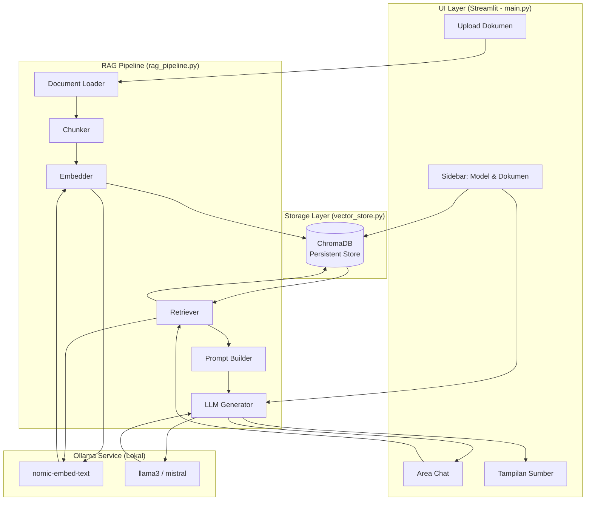
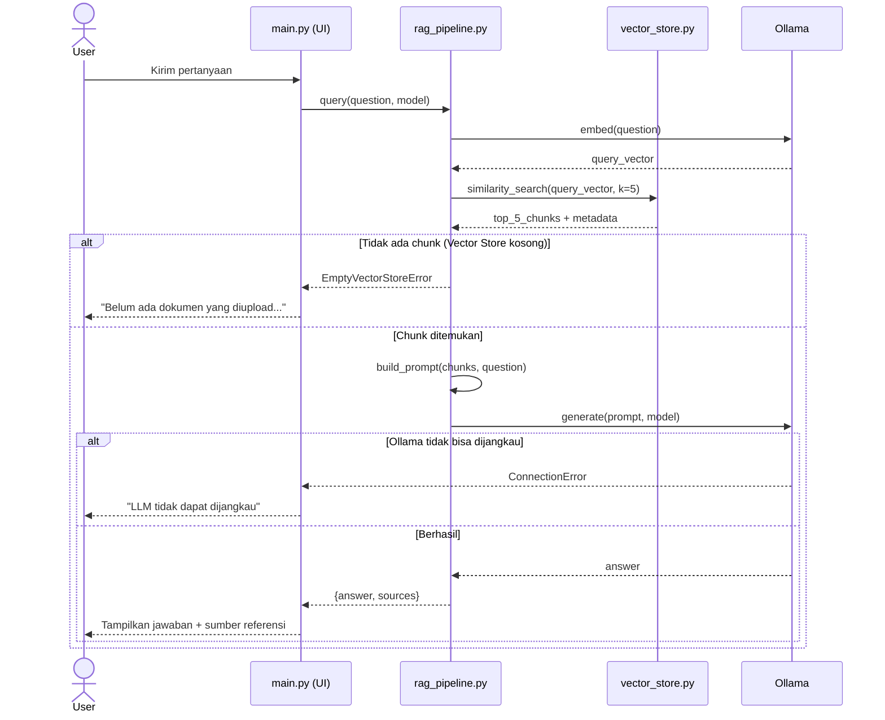
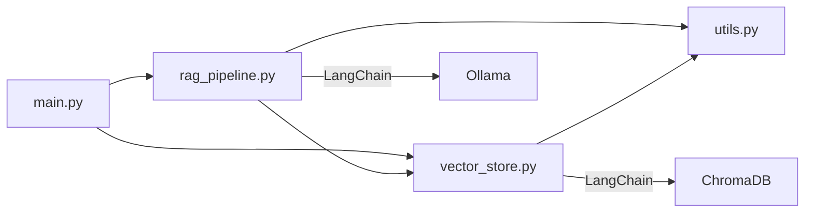

# Design Document: RAG Novel Assistant

## Overview

RAG Novel Assistant adalah aplikasi berbasis Retrieval-Augmented Generation (RAG) yang berjalan sepenuhnya secara lokal. Aplikasi ini memungkinkan penulis novel dan pembaca untuk mengupload dokumen novel (PDF, TXT, DOCX) dan mengajukan pertanyaan tentang isi novel — karakter, alur, latar, konflik, dan tema.

Sistem menggunakan LLM lokal melalui Ollama (llama3/mistral) dan embedding model nomic-embed-text. Semua pemrosesan berlangsung di mesin lokal pengguna sehingga tidak ada biaya API eksternal dan data novel tetap privat.

**Tujuan utama desain:**
- Jawaban LLM harus selalu berbasis dokumen yang diupload, bukan pengetahuan umum
- Penyimpanan vektor persisten agar dokumen tidak perlu diproses ulang setiap sesi
- Antarmuka sederhana dalam Bahasa Indonesia yang mudah digunakan oleh penulis non-teknis
- Arsitektur modular yang memisahkan pipeline RAG, vector store management, dan UI

---

## Architecture

### Diagram Arsitektur Sistem



### Alur Data: Upload Dokumen

```mermaid
sequenceDiagram
    actor User
    participant UI as main.py (UI)
    participant Pipeline as rag_pipeline.py
    participant VStore as vector_store.py
    participant Ollama

    User->>UI: Upload file (PDF/TXT/DOCX)
    UI->>Pipeline: validate_and_load(file)
    Pipeline->>Pipeline: validasi format & ukuran
    alt Format/ukuran tidak valid
        Pipeline-->>UI: ValidationError
        UI-->>User: Pesan error
    else Valid
        Pipeline->>Pipeline: extract_text() + metadata
        Pipeline->>Pipeline: chunk_document()
        Pipeline->>VStore: check_document_exists(filename)
        alt Dokumen sudah ada
            VStore-->>UI: DuplicateDocumentNotice
            UI-->>User: "Dokumen sudah ada"
        else Baru
            Pipeline->>Ollama: embed(chunks)
            alt Ollama tidak bisa dijangkau
                Ollama-->>UI: ConnectionError
                UI-->>User: "Ollama tidak dapat dijangkau"
            else Berhasil
                Ollama-->>Pipeline: vectors
                Pipeline->>VStore: store(chunks + vectors)
                VStore-->>UI: StorageConfirmation(n_chunks)
                UI-->>User: "Dokumen siap, N chunk tersimpan"
            end
        end
    end
```



### Alur Data: Query dan Jawaban



### Keputusan Arsitektur

| Keputusan | Pilihan | Alasan |
|---|---|---|
| LLM Backend | Ollama lokal | Gratis, privat, tidak butuh internet |
| Vector Database | ChromaDB | Ringan, persisten, mudah diintegrasikan dengan LangChain |
| Embedding | nomic-embed-text via Ollama | Konsisten dengan LLM backend, tidak butuh API key |
| RAG Framework | LangChain | Ekosistem matang, konektor siap pakai untuk Chroma & Ollama |
| UI | Streamlit | Cepat dibangun, cocok untuk aplikasi data/ML |
| Chunking | Per paragraf / 500 token + overlap 50 | Balance antara konteks dan presisi retrieval |

---

## Components and Interfaces

### 1. `main.py` — Entry Point Streamlit

Bertanggung jawab atas seluruh rendering UI dan orkestrasi panggilan ke pipeline.

```python
# Interface utama
def render_sidebar() -> dict:
    """
    Merender sidebar dengan komponen upload dan pilihan model.
    Mengembalikan konfigurasi: {'model': str, 'uploaded_file': UploadedFile | None}
    """

def render_chat_area(session_state: dict) -> None:
    """Merender area chat dengan riwayat percakapan."""

def handle_upload(uploaded_file, pipeline: RAGPipeline) -> None:
    """Menangani upload file dan memanggil pipeline untuk pemrosesan."""

def handle_query(question: str, model: str, pipeline: RAGPipeline) -> None:
    """Menangani query pengguna dan menampilkan jawaban beserta sumber."""

def render_document_list(vector_store: VectorStoreManager) -> None:
    """Menampilkan daftar dokumen yang telah diproses."""

def handle_reset(vector_store: VectorStoreManager) -> None:
    """Menangani reset vector store dengan dialog konfirmasi."""
```

**State Streamlit yang dikelola:**
- `st.session_state.chat_history` — List pasangan (pertanyaan, jawaban), maks 50
- `st.session_state.selected_model` — Model Ollama yang aktif, default `llama3`
- `st.session_state.documents_ready` — Boolean, apakah ada dokumen yang siap diquery

---

### 2. `rag_pipeline.py` — RAG Pipeline

Komponen inti yang mengorkestrasi alur kerja lengkap dari pemrosesan dokumen hingga generasi jawaban.

```python
class RAGPipeline:
    """Pipeline RAG end-to-end untuk RAG Novel Assistant."""

    def __init__(self, vector_store: VectorStoreManager, ollama_base_url: str):
        """Menginisialisasi pipeline dengan vector store dan URL Ollama."""

    def load_and_process_document(self, file_path: str, filename: str) -> ProcessResult:
        """
        Memuat, memvalidasi, men-chunk, dan menyimpan dokumen ke vector store.
        Mengembalikan ProcessResult dengan status, jumlah chunk, dan pesan.
        """

    def query(self, question: str, model: str) -> QueryResult:
        """
        Menjalankan pipeline RAG lengkap untuk sebuah pertanyaan.
        Mengembalikan QueryResult dengan answer dan list sumber referensi.
        """

    def _validate_file(self, file_path: str, filename: str) -> None:
        """Memvalidasi format dan ukuran file. Raise ValidationError jika tidak valid."""

    def _extract_text(self, file_path: str) -> list[Document]:
        """Mengekstrak teks dan metadata dari dokumen menggunakan LangChain loaders."""

    def _chunk_documents(self, documents: list[Document]) -> list[Chunk]:
        """Memecah dokumen menjadi chunk dengan overlap menggunakan strategi yang ditentukan."""

    def _build_prompt(self, chunks: list[Chunk], question: str) -> str:
        """Membangun prompt dengan instruksi eksplisit untuk menjawab berdasarkan konteks."""
```

**Data classes:**

```python
@dataclass
class ProcessResult:
    success: bool
    chunks_stored: int
    chunks_failed: int
    message: str

@dataclass
class QueryResult:
    answer: str
    sources: list[SourceReference]
    error: str | None = None

@dataclass
class SourceReference:
    filename: str
    position: str  # "Halaman N", "Bab N", atau ""
    chunk_index: int
```

---

### 3. `vector_store.py` — Vector Store Manager

Mengelola semua interaksi dengan ChromaDB.

```python
class VectorStoreManager:
    """Mengelola ChromaDB untuk penyimpanan dan retrieval vektor."""

    def __init__(self, persist_directory: str, embedding_function):
        """Menginisialisasi ChromaDB dengan direktori persisten."""

    def document_exists(self, filename: str) -> bool:
        """Memeriksa apakah dokumen dengan nama file tersebut sudah ada."""

    def store_chunks(self, chunks: list[Chunk]) -> StorageResult:
        """Menyimpan chunk beserta embedding ke ChromaDB."""

    def similarity_search(self, query_vector: list[float], k: int = 5) -> list[Chunk]:
        """Mencari k chunk paling relevan berdasarkan similarity vektor."""

    def get_document_list(self) -> list[DocumentInfo]:
        """Mengembalikan daftar dokumen yang tersimpan beserta jumlah chunk per dokumen."""

    def delete_all(self) -> bool:
        """Menghapus semua data dari ChromaDB. Mengembalikan True jika berhasil."""

    def get_chunk_count(self) -> int:
        """Mengembalikan total jumlah chunk yang tersimpan."""
```

**Data classes:**

```python
@dataclass
class DocumentInfo:
    filename: str
    chunk_count: int

@dataclass
class StorageResult:
    stored: int
    failed: int
```

---

### 4. `utils.py` — Helper Functions

```python
def validate_file_format(filename: str) -> bool:
    """Memeriksa apakah ekstensi file adalah PDF, TXT, atau DOCX."""

def validate_file_size(file_size_bytes: int, max_mb: int = 50) -> bool:
    """Memeriksa apakah ukuran file tidak melebihi batas maksimal."""

def count_tokens(text: str) -> int:
    """Menghitung jumlah token (kata dipisahkan spasi) dalam teks."""

def truncate_to_token_limit(text: str, max_tokens: int, overlap: int = 50) -> list[str]:
    """Memecah teks menjadi segmen dengan batas token dan overlap."""

def format_source_reference(filename: str, page: int | None, chapter: int | None) -> str:
    """Memformat referensi sumber menjadi string yang mudah dibaca."""

def check_ollama_connection(base_url: str) -> bool:
    """Memeriksa apakah Ollama dapat dijangkau di URL yang diberikan."""
```

---

## Data Models

### Chunk Schema (disimpan di ChromaDB)

Setiap chunk yang tersimpan di ChromaDB memiliki struktur berikut:

```python
# Document (teks chunk)
chunk_text: str  # Teks potongan dokumen

# Metadata per chunk
metadata = {
    "filename": str,           # Nama file sumber, contoh: "novel_abc.pdf"
    "page_number": int | None, # Nomor halaman (untuk PDF), None jika tidak tersedia
    "chapter": str | None,     # Nomor/nama bab jika tersedia, None jika tidak
    "chunk_index": int,        # Indeks chunk dalam dokumen (0-based)
    "token_count": int,        # Jumlah token dalam chunk ini
    "source_type": str,        # Tipe sumber: "pdf", "txt", "docx"
}

# ID unik per chunk
chunk_id: str  # Format: "{filename}_{chunk_index}"
```

### Session State Schema (Streamlit)

```python
st.session_state = {
    "chat_history": list[tuple[str, str]],  # List (pertanyaan, jawaban), maks 50
    "selected_model": str,                   # "llama3" atau "mistral"
    "documents_ready": bool,                 # True jika ada dokumen di Vector Store
    "processing": bool,                      # True saat sedang memproses dokumen/query
    "show_reset_dialog": bool,               # True saat dialog konfirmasi reset aktif
}
```

### Konfigurasi Aplikasi (`.env`)

```ini
OLLAMA_BASE_URL=http://localhost:11434
DEFAULT_MODEL=llama3
CHROMA_PERSIST_DIR=./chroma_db
DOCS_DIR=./docs
MAX_FILE_SIZE_MB=50
CHUNK_SIZE_TOKENS=500
CHUNK_OVERLAP_TOKENS=50
TOP_K_CHUNKS=5
MAX_CHAT_HISTORY=50
```

### Prompt Template

```
Kamu adalah asisten yang membantu menjawab pertanyaan tentang novel berdasarkan
dokumen yang diberikan. PENTING: Jawab HANYA berdasarkan konteks di bawah ini.
Jangan gunakan pengetahuan umum yang tidak ada dalam konteks.
Jika informasi tidak ditemukan dalam konteks, jawab dengan:
"Informasi ini tidak ditemukan dalam dokumen yang diupload."

Konteks dari novel:
{context}

Pertanyaan: {question}

Jawaban:
```

### Dependency Graph Komponen



---

## Correctness Properties

*A property adalah karakteristik atau perilaku yang harus berlaku benar di seluruh eksekusi sistem yang valid — pada dasarnya, pernyataan formal tentang apa yang seharusnya dilakukan sistem. Properties menjembatani antara spesifikasi yang dapat dibaca manusia dan jaminan kebenaran yang dapat diverifikasi mesin.*

**Catatan PBT Applicability**: Fitur ini sangat cocok untuk property-based testing karena melibatkan fungsi-fungsi murni (validasi, chunking, prompt building) dan transformasi data yang dapat diuji secara universal dengan input yang di-generate. Komponen yang bergantung pada Ollama dan ChromaDB akan diuji dengan integration tests.

**Library PBT yang digunakan**: [Hypothesis](https://hypothesis.readthedocs.io/) untuk Python

---

### Property 1: Validasi Format dan Ukuran File Konsisten

*Untuk semua* kombinasi nama file dan ukuran file, fungsi validasi harus secara konsisten menerima file jika dan hanya jika ekstensi adalah salah satu dari {`.pdf`, `.txt`, `.docx`} DAN ukuran tidak melebihi 50 MB — tidak ada kondisi lain yang boleh mengubah hasil validasi.

**Validates: Requirements 1.1, 1.2**

---

### Property 2: Tidak Ada Chunk yang Melebihi Batas Token

*Untuk semua* teks dokumen dengan panjang berapa pun (minimal 1 token), setiap chunk yang dihasilkan oleh Chunker harus memiliki jumlah token (kata dipisahkan spasi) tidak lebih dari 500.

**Validates: Requirements 2.1, 2.4**

---

### Property 3: Overlap Antar Chunk Berurutan

*Untuk semua* dokumen yang menghasilkan lebih dari satu chunk, 50 token terakhir dari chunk ke-N harus identik dengan 50 token pertama dari chunk ke-(N+1), untuk setiap N yang valid dalam dokumen yang sama.

**Validates: Requirements 2.2**

---

### Property 4: Setiap Chunk Memiliki Metadata Lengkap

*Untuk semua* dokumen yang di-chunk, setiap chunk yang dihasilkan harus memiliki field metadata `filename` (string non-kosong) dan `chunk_index` (integer >= 0). Jika metadata halaman/bab tidak tersedia, field tersebut boleh berisi nilai `None`, bukan absen.

**Validates: Requirements 2.3**

---

### Property 5: Dokumen Non-Kosong Menghasilkan Minimal Satu Chunk

*Untuk semua* teks yang mengandung setidaknya satu token (kata non-spasi), fungsi chunking harus mengembalikan list dengan minimal satu elemen.

**Validates: Requirements 2.5**

---

### Property 6: Deduplikasi Dokumen Berdasarkan Nama File

*Untuk semua* vector store yang sudah mengandung dokumen dengan filename tertentu, mencoba menyimpan dokumen lain dengan filename yang sama harus tidak mengubah jumlah total chunk yang tersimpan di vector store.

**Validates: Requirements 3.3**

---

### Property 7: Akuntansi Penyimpanan Chunk Akurat

*Untuk semua* batch chunk yang dikirimkan ke Vector_Store, jumlah `stored + failed` dalam StorageResult harus selalu sama persis dengan jumlah chunk dalam batch input.

**Validates: Requirements 3.5**

---

### Property 8: Retrieval Tidak Melebihi Top-K

*Untuk semua* query dan vector store dengan N chunk (N >= 0), jumlah chunk yang dikembalikan oleh Retriever harus selalu `min(N, 5)` — tidak lebih dari 5, dan tidak melebihi apa yang tersedia.

**Validates: Requirements 4.1, 4.4, 4.5**

---

### Property 9: Metadata Lengkap di Setiap Hasil Retrieval

*Untuk semua* query yang menghasilkan setidaknya satu chunk, setiap chunk dalam hasil retrieval harus memiliki metadata `filename` dan `chunk_index` yang valid (non-None, non-kosong).

**Validates: Requirements 4.3**

---

### Property 10: Urutan Hasil Retrieval Berdasarkan Skor Similarity

*Untuk semua* query yang menghasilkan lebih dari satu chunk, skor kemiripan dari chunk yang dikembalikan harus dalam urutan descending (skor tertinggi di posisi pertama).

**Validates: Requirements 4.7**

---

### Property 11: Prompt Selalu Mengandung Instruksi Konteks dan Fallback

*Untuk semua* kombinasi chunk konteks (minimal 1 chunk) dan pertanyaan pengguna yang valid, prompt yang dihasilkan oleh `build_prompt()` harus selalu mengandung:
1. Teks instruksi yang mengarahkan LLM untuk menjawab hanya berdasarkan konteks
2. Teks fallback "tidak ditemukan dalam dokumen yang diupload"
3. Seluruh teks dari setiap chunk yang diberikan

**Validates: Requirements 5.2, 5.4**

---

### Property 12: Format Referensi Sumber Konsisten

*Untuk semua* kombinasi (filename, page_number, chapter), fungsi `format_source_reference()` harus mengembalikan string yang selalu mengandung filename, dan jika page_number atau chapter tersedia (non-None), string harus mengandung format "Halaman [N]" atau "Bab [N]" yang sesuai.

**Validates: Requirements 6.2, 6.4**

---

### Property 13: Batas Riwayat Chat Dipertahankan

*Untuk semua* urutan penambahan pasangan (pertanyaan, jawaban) ke riwayat chat, jumlah pasangan dalam `chat_history` tidak boleh pernah melebihi 50, dan ketika batas tercapai, pasangan yang dihapus adalah yang paling lama (FIFO).

**Validates: Requirements 7.6**

---

### Property 14: Penambahan Dokumen Baru Tidak Menghapus Dokumen Lama

*Untuk semua* vector store yang sudah mengandung dokumen A, menyimpan dokumen baru B (dengan filename berbeda) harus tidak mengubah atau menghapus chunk dari dokumen A.

**Validates: Requirements 9.2**

---

### Property 15: Reset Mengosongkan Semua Data (Round-Trip)

*Untuk semua* vector store yang berisi sejumlah dokumen (>0 dokumen), setelah operasi `delete_all()` berhasil, `get_chunk_count()` harus mengembalikan 0 dan `get_document_list()` harus mengembalikan list kosong.

**Validates: Requirements 9.5, 9.6**

---

**Property Reflection** (hasil review redundansi):
- Property 8 mencakup kasus edge dari AC 4.4 (k < 5) dan AC 4.5 (store kosong), sehingga tidak perlu property terpisah untuk keduanya.
- Property 11 menggabungkan AC 5.2 dan 5.4 karena keduanya menguji konstruksi prompt yang sama.
- Property 15 menggabungkan AC 9.5 dan 9.6 karena keduanya adalah bagian dari round-trip operasi reset yang sama.
- AC tentang koneksi Ollama (1.4, 3.4, 5.6, 8.4) tidak menjadi property karena menguji perilaku external service, bukan logika kode kita — diuji via integration tests.

---

## Error Handling

### Hierarki Exception

```python
class RAGNovelError(Exception):
    """Base exception untuk RAG Novel Assistant."""

class ValidationError(RAGNovelError):
    """File tidak valid: format tidak didukung atau ukuran melebihi batas."""

class OllamaConnectionError(RAGNovelError):
    """Ollama tidak dapat dijangkau di URL yang dikonfigurasi."""

class OllamaModelNotFoundError(RAGNovelError):
    """Model Ollama yang diminta belum diunduh atau tidak tersedia."""

class ChromaDBError(RAGNovelError):
    """ChromaDB tidak dapat diakses atau operasi gagal."""

class DuplicateDocumentError(RAGNovelError):
    """Dokumen dengan nama file yang sama sudah ada di Vector Store."""

class EmptyDocumentError(RAGNovelError):
    """Dokumen tidak mengandung teks yang dapat diproses."""

class EmptyVectorStoreError(RAGNovelError):
    """Vector Store kosong, tidak ada dokumen yang telah diproses."""
```

### Error Handling per Komponen

| Kondisi Error | Exception | Perilaku Sistem | Pesan UI |
|---|---|---|---|
| Format file tidak didukung | `ValidationError` | Hentikan proses, jangan simpan | "Format file tidak didukung. Gunakan PDF, TXT, atau DOCX." |
| Ukuran file > 50 MB | `ValidationError` | Hentikan proses | "Ukuran file melebihi batas 50 MB." |
| Dokumen kosong (0 token) | `EmptyDocumentError` | Return list chunk kosong | "Dokumen tidak mengandung teks yang dapat diproses." |
| Dokumen duplikat | `DuplicateDocumentError` | Skip penyimpanan | "Dokumen '[nama]' sudah ada di sistem." |
| Ollama tidak bisa dijangkau (embedding) | `OllamaConnectionError` | Hentikan embedding, rollback | "Ollama tidak dapat dijangkau. Pastikan Ollama berjalan." |
| Ollama tidak bisa dijangkau (query) | `OllamaConnectionError` | Hentikan query, jangan ubah chat history | "LLM tidak dapat dijangkau. Coba lagi nanti." |
| Model belum diunduh | `OllamaModelNotFoundError` | Hentikan query | "Model '[nama]' belum tersedia. Jalankan: `ollama pull [nama]`" |
| ChromaDB tidak bisa diakses (simpan) | `ChromaDBError` | Hentikan penyimpanan, rollback | "Penyimpanan gagal. Tidak dapat mengakses vector store." |
| ChromaDB tidak bisa diakses (reset) | `ChromaDBError` | Pertahankan state saat ini | "Penghapusan gagal. Vector store tetap tidak berubah." |
| Vector Store kosong saat query | `EmptyVectorStoreError` | Return response kosong | "Belum ada dokumen yang diupload. Silakan upload novel terlebih dahulu." |
| Chunk gagal embed (sebagian) | Warning (log) | Lanjutkan chunk lain, laporkan jumlah gagal | "Berhasil menyimpan N chunk. M chunk gagal diproses." |

### Strategi Partial Failure (Embedding)

Ketika sebagian chunk gagal dalam proses embedding (AC 3.7), sistem menggunakan strategi **best-effort dengan pelaporan**:

```
Mulai proses batch chunks
  Untuk setiap chunk:
    Coba embed dan simpan
    Jika gagal: catat ke failed_count, lanjutkan
    Jika berhasil: tambah ke stored_count
  Akhir batch:
    Laporkan StorageResult(stored=stored_count, failed=failed_count)
    Jika stored_count == 0: tampilkan warning kritis
    Jika failed_count > 0: tampilkan warning informatif
```

---

## Testing Strategy

### Pendekatan Dual Testing

Strategi pengujian menggunakan dua lapisan komplementer:

1. **Property-Based Tests (Hypothesis)** — Mengverifikasi universal properties dari logika bisnis murni
2. **Example-Based Unit Tests (pytest)** — Mengverifikasi contoh spesifik, edge cases, dan interaksi komponen
3. **Integration Tests** — Mengverifikasi interaksi dengan Ollama dan ChromaDB

### Property-Based Testing (Hypothesis)

**Library**: `hypothesis` (Python)
**Konfigurasi**: Minimum 100 iterasi per property test

Setiap property test di-tag dengan komentar referensi:

```python
# Feature: rag-novel-assistant, Property N: [deskripsi singkat property]
```

**Daftar Property Tests yang akan diimplementasi:**

```python
# app/tests/test_properties.py

from hypothesis import given, settings
from hypothesis import strategies as st

# Feature: rag-novel-assistant, Property 1: Validasi format dan ukuran konsisten
@given(
    filename=st.text(min_size=1).map(lambda s: s + st.sampled_from(['.pdf','.txt','.docx','.exe','.jpg']).example()),
    size_mb=st.floats(min_value=0.1, max_value=100.0)
)
@settings(max_examples=100)
def test_file_validation_consistent(filename, size_mb): ...

# Feature: rag-novel-assistant, Property 2: Chunk tidak melebihi 500 token
@given(text=st.text(min_size=1, max_size=10000))
@settings(max_examples=100)
def test_chunks_within_token_limit(text): ...

# Feature: rag-novel-assistant, Property 3: Overlap 50 token antar chunk berurutan
@given(text=st.text(min_size=1000))
@settings(max_examples=100)
def test_chunk_overlap_consistency(text): ...

# Feature: rag-novel-assistant, Property 4: Metadata lengkap di setiap chunk
@given(text=st.text(min_size=1), filename=st.text(min_size=1))
@settings(max_examples=100)
def test_chunk_metadata_completeness(text, filename): ...

# Feature: rag-novel-assistant, Property 5: Dokumen non-kosong menghasilkan min 1 chunk
@given(text=st.text(min_size=1).filter(lambda s: len(s.split()) >= 1))
@settings(max_examples=100)
def test_non_empty_document_produces_chunks(text): ...

# Feature: rag-novel-assistant, Property 7: Akuntansi penyimpanan chunk akurat
@given(n_chunks=st.integers(min_value=1, max_value=50))
@settings(max_examples=100)
def test_storage_accounting_accurate(n_chunks): ...

# Feature: rag-novel-assistant, Property 8: Retrieval tidak melebihi top-K
@given(n_stored=st.integers(min_value=0, max_value=20))
@settings(max_examples=100)
def test_retrieval_max_k_chunks(n_stored): ...

# Feature: rag-novel-assistant, Property 10: Urutan hasil retrieval descending
@given(n_chunks=st.integers(min_value=2, max_value=5))
@settings(max_examples=100)
def test_retrieval_ordered_by_score(n_chunks): ...

# Feature: rag-novel-assistant, Property 11: Prompt mengandung instruksi konteks dan fallback
@given(
    chunks=st.lists(st.text(min_size=10), min_size=1, max_size=5),
    question=st.text(min_size=5)
)
@settings(max_examples=100)
def test_prompt_contains_required_instructions(chunks, question): ...

# Feature: rag-novel-assistant, Property 12: Format referensi sumber konsisten
@given(
    filename=st.text(min_size=1),
    page=st.one_of(st.none(), st.integers(min_value=1)),
    chapter=st.one_of(st.none(), st.text(min_size=1))
)
@settings(max_examples=100)
def test_source_reference_format_consistent(filename, page, chapter): ...

# Feature: rag-novel-assistant, Property 13: Batas riwayat chat tidak terlampaui
@given(n_messages=st.integers(min_value=51, max_value=200))
@settings(max_examples=100)
def test_chat_history_max_limit(n_messages): ...
```

### Example-Based Unit Tests (pytest)

```
app/tests/
├── test_validation.py          # Contoh validasi: format valid, format tidak valid, ukuran batas
├── test_chunking.py            # Contoh chunking: dokumen kosong, satu paragraf, paragraf panjang
├── test_vector_store.py        # Contoh CRUD ChromaDB dengan mocks
├── test_rag_pipeline.py        # Contoh pipeline end-to-end dengan mocks Ollama
├── test_utils.py               # Contoh utilitas: count_tokens, format_source_reference
└── test_properties.py          # Property-based tests (Hypothesis)
```

**Contoh unit test kunci:**

```python
# Dokumen kosong → daftar chunk kosong
def test_empty_document_returns_no_chunks():
    result = chunker.chunk_document("")
    assert result == []

# Model belum diunduh → error dengan instruksi
def test_model_not_found_shows_download_instruction():
    with pytest.raises(OllamaModelNotFoundError) as exc:
        pipeline.query("pertanyaan", model="nonexistent-model")
    assert "ollama pull" in str(exc.value)

# Vector store kosong → pesan yang benar
def test_empty_vector_store_returns_correct_message():
    result = pipeline.query("pertanyaan apa pun")
    assert result.error == "Belum ada dokumen yang diupload"

# Reset mengosongkan semua data
def test_reset_clears_all_data():
    store.store_chunks(sample_chunks)
    store.delete_all()
    assert store.get_chunk_count() == 0
```

### Integration Tests

Integration tests dijalankan secara terpisah (memerlukan Ollama dan ChromaDB berjalan):

```python
# app/tests/integration/
# test_ollama_integration.py  — Memerlukan Ollama aktif
# test_chromadb_integration.py — Memerlukan ChromaDB aktif
# test_full_pipeline.py       — End-to-end dengan dokumen nyata
```

**Kriteria yang diuji via integration tests:**
- AC 3.1: Embedding menghasilkan vektor dengan dimensi konsisten
- AC 3.2: Persistensi ChromaDB bertahan setelah restart
- AC 5.1: LLM menghasilkan jawaban non-kosong untuk query valid
- AC 8.4: Koneksi Ollama gagal ditangani tanpa mengubah chat history

### Cakupan Test

| Lapisan | Tools | Kecepatan | Dependensi Eksternal |
|---|---|---|---|
| Unit Tests | pytest | Cepat (< 5 detik) | Tidak ada (semua di-mock) |
| Property Tests | pytest + hypothesis | Sedang (< 30 detik) | Tidak ada (semua di-mock) |
| Integration Tests | pytest | Lambat (> 60 detik) | Ollama + ChromaDB harus aktif |

**Menjalankan tests:**
```bash
# Unit + property tests saja (cepat)
pytest app/tests/ -v --ignore=app/tests/integration

# Semua tests termasuk integration
pytest app/tests/ -v

# Satu property test
pytest app/tests/test_properties.py::test_chunks_within_token_limit -v
```
